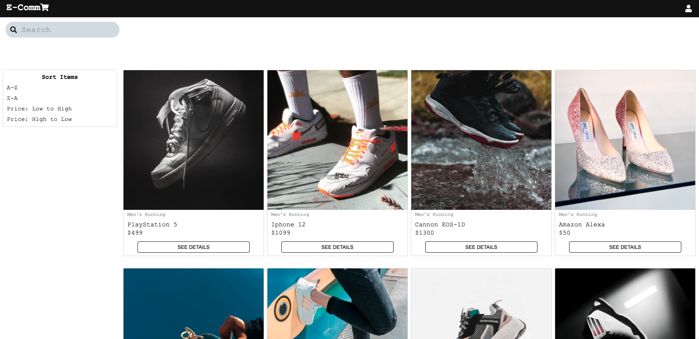

# Welcome to Ecomm!

I built a full stack ecommerce web application using the **MERN stack**. Included on the frontend is React/Redux, Thunk, Hooks, and CSS Grid. The backend utilizes MongoDB and Express to store the data. 

### Features include:
 - Fully responsive design
 - Filter Logic to sort the products alphabetically or by price
 - Search in real time as you type
 - Individual product pages
 - Cart page
 - Real time calculated cart totals

### Currently being worked on:
 - API Caching for quicker functionality and a better UX
 - Pricing filters
 - Category filters
 - Dark Mode
 - Checkout modal
 - Progressive Web Application
 - Load more items as you scroll
 - Lazy Loading images

